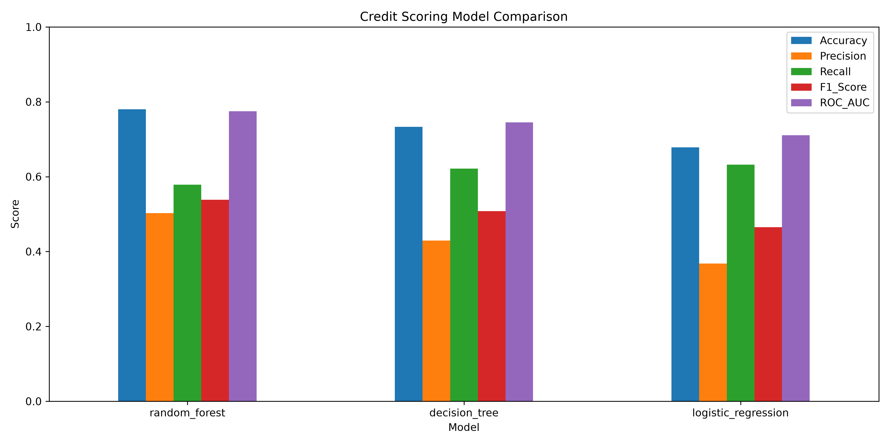
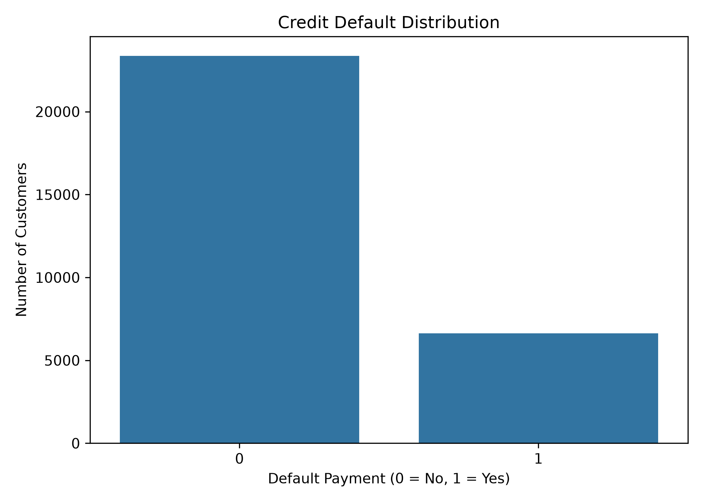
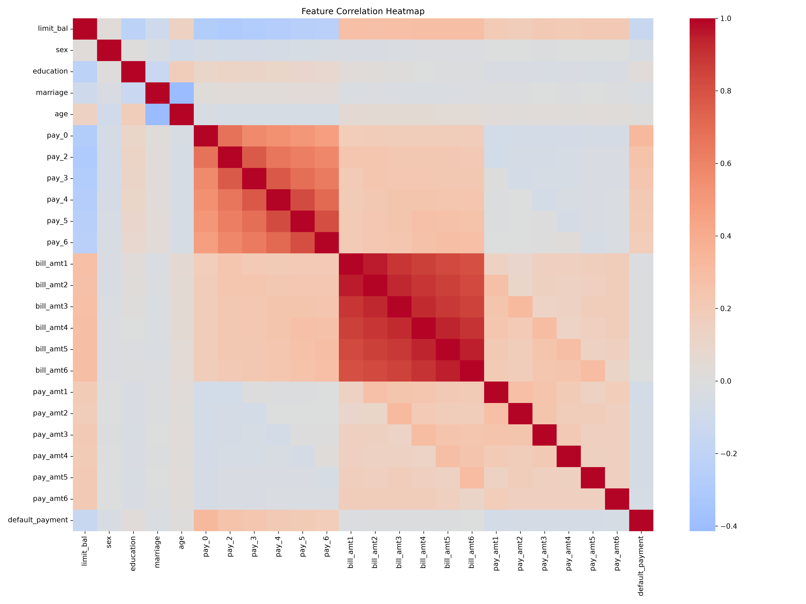
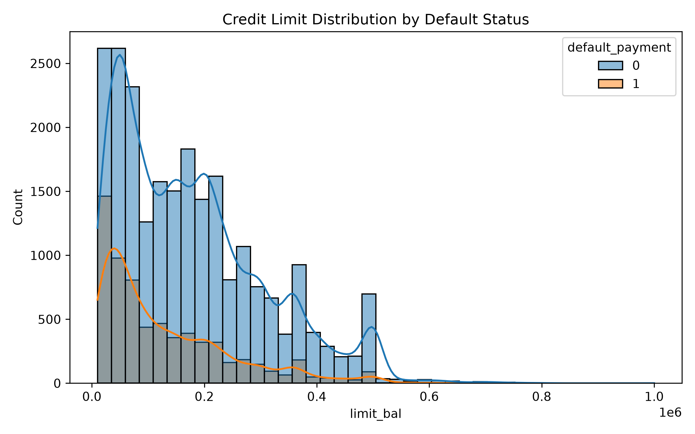
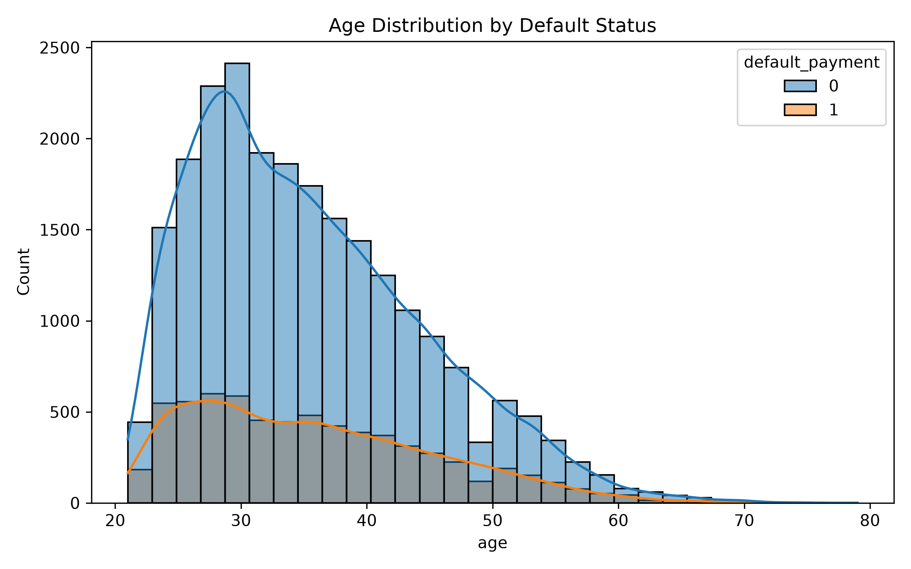
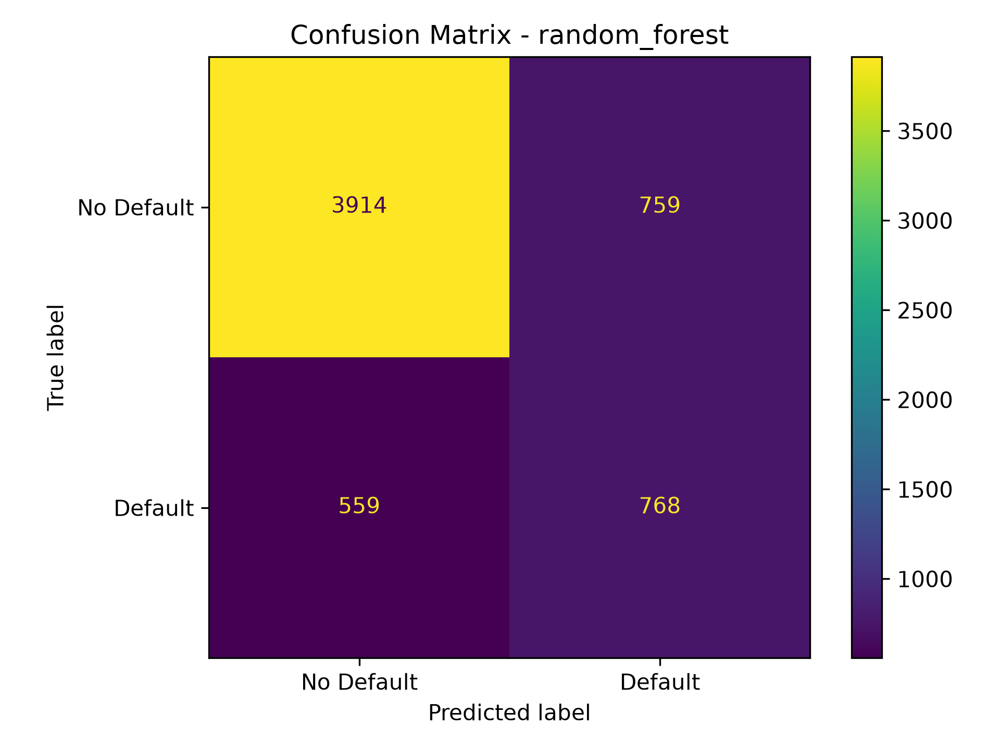
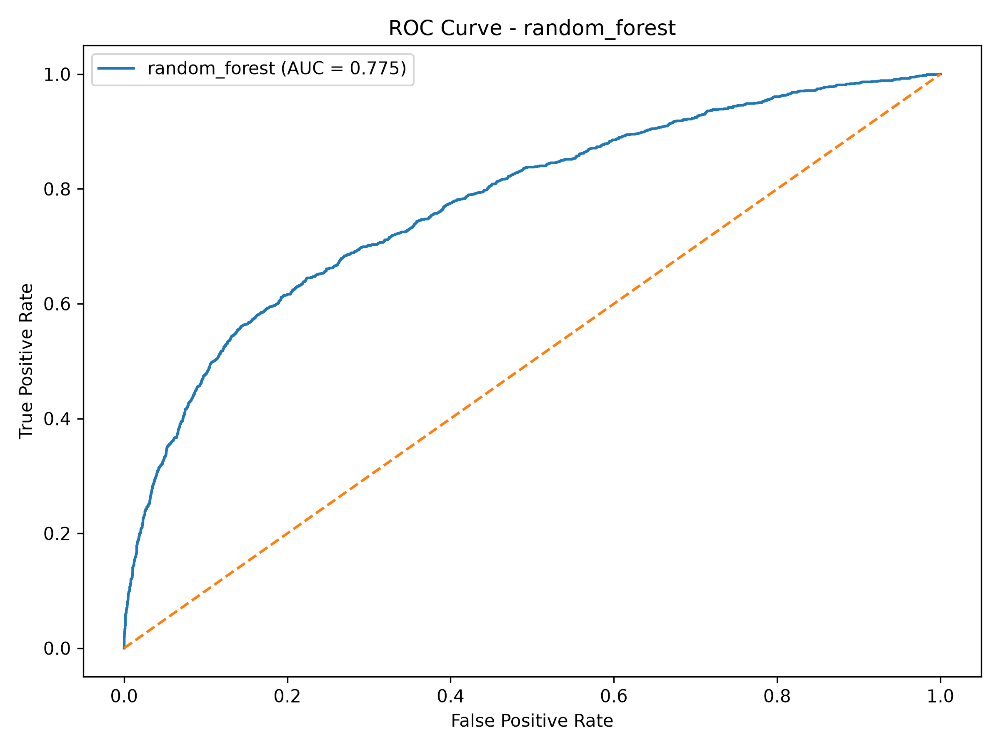

# 💳 Credit Scoring Model

**CodeAlpha Machine Learning Internship — Task 1**

An end-to-end machine learning classification project for predicting credit-card payment default from customer demographic, credit, billing, and repayment-history information.

## 🎯 Objective

Develop a machine learning classification system that predicts whether a customer is likely to default on a credit-card payment.

The project compares three classification algorithms:

- Logistic Regression
- Decision Tree
- Random Forest

Performance is evaluated using Accuracy, Precision, Recall, F1-Score, and ROC-AUC.

## 🧭 Project Workflow

```text
UCI Dataset
    ↓
Data Preprocessing
    ↓
Exploratory Data Analysis
    ↓
Stratified 80/20 Train-Test Split
    ↓
Feature Preprocessing
    ├── Numerical → Median Imputation + Standard Scaling
    └── Categorical → Most-Frequent Imputation + One-Hot Encoding
    ↓
Model Training
    ├── Logistic Regression
    ├── Decision Tree
    └── Random Forest
    ↓
Model Evaluation
    ├── Accuracy
    ├── Precision
    ├── Recall
    ├── F1-Score
    └── ROC-AUC
    ↓
Model Comparison
    ↓
Best Model Selection
    ↓
Credit Default Prediction
```

## 📊 Dataset

**Default of Credit Card Clients Dataset** from the UCI Machine Learning Repository.

- 30,000 customer records
- 25 original columns
- 24 columns after removing the identifier
- Binary target: `default_payment`

### Target Classes

| Value | Meaning |
|---:|---|
| 0 | No Default |
| 1 | Default |

### Target Distribution

| Class | Records | Share |
|---|---:|---:|
| No Default | 23,364 | 77.88% |
| Default | 6,636 | 22.12% |

### Main Feature Groups

- Credit limit
- Age
- Sex
- Education
- Marriage
- Monthly payment-status history
- Monthly bill amounts
- Monthly previous payment amounts

### Dataset Source

UCI Machine Learning Repository: https://archive.ics.uci.edu/dataset/350/default%2Bof%2Bcredit%2Bcard%2Bclients%2Bdataset

The raw dataset is **not committed** to this repository. Download it from the official source and place the Excel file in `data/raw/`.

## 🧹 Data Preprocessing

The preprocessing stage:

1. Loads the UCI Excel dataset.
2. Cleans and standardizes column names.
3. Removes the `id` identifier because it is not a predictive feature.
4. Normalizes the target column to `default_payment`.
5. Handles common missing-value markers.
6. Converts numerical features to numeric data types.
7. Preserves `sex`, `education`, and `marriage` as categorical variables.
8. Saves the processed dataset locally to `data/processed/credit_data_processed.csv`.

During model training, preprocessing is handled inside a scikit-learn pipeline:

- **Numerical features:** median imputation + `StandardScaler`
- **Categorical features:** most-frequent imputation + `OneHotEncoder`

This keeps preprocessing consistent between training and prediction.

## 📈 Exploratory Data Analysis

The EDA stage generates:

| Visualization | Output |
|---|---|
| Target distribution | `results/target_distribution.png` |
| Age distribution | `results/age_distribution.png` |
| Credit-limit distribution | `results/credit_limit_distribution.png` |
| Correlation heatmap | `results/correlation_heatmap.png` |

## 🤖 Machine Learning Models

### 1. Logistic Regression

A linear classification baseline that estimates the probability of the default class.

### 2. Decision Tree

A tree-based classifier that learns decision rules from feature values.

### 3. Random Forest

An ensemble of decision trees that combines multiple tree predictions. It achieved the strongest overall performance in the current experiment.

All three models use `class_weight="balanced"` to account for the imbalanced target classes.

## 📏 Evaluation Metrics

- **Accuracy:** overall proportion of correct predictions.
- **Precision:** proportion of predicted defaults that are actual defaults.
- **Recall:** proportion of actual defaults correctly detected.
- **F1-Score:** harmonic balance between precision and recall.
- **ROC-AUC:** ability to distinguish default and non-default cases across classification thresholds.

Because the target classes are imbalanced, F1-Score and ROC-AUC are considered alongside accuracy.

## 🏆 Model Results

The current evaluated results are:

| Model | Accuracy | Precision | Recall | F1-Score | ROC-AUC |
|---|---:|---:|---:|---:|---:|
| **Random Forest** | **78.03%** | **50.29%** | 57.87% | **53.82%** | **77.46%** |
| Decision Tree | 73.35% | 42.92% | **62.17%** | 50.78% | 74.50% |
| Logistic Regression | 67.82% | 36.77% | **63.23%** | 46.49% | 71.06% |

### 🥇 Best Model

**Random Forest** is the best overall model in the current experiment because it has the highest F1-Score and ROC-AUC.

- Accuracy: **78.03%**
- Precision: **50.29%**
- Recall: **57.87%**
- F1-Score: **53.82%**
- ROC-AUC: **77.46%**

Decision Tree and Logistic Regression provide higher recall, but lower precision and F1-Score in this experiment.

## 📊 Results & Visualizations

### Model Comparison



### Target Distribution



### Correlation Heatmap



### Credit Limit Distribution



### Age Distribution



### Random Forest Confusion Matrix



### Random Forest ROC Curve



Additional Decision Tree and Logistic Regression confusion matrices and ROC curves are available in `results/`.

## 🔮 Prediction

The project includes a prediction script using the trained Random Forest pipeline.

Example local prediction from the current experiment:

```text
Prediction: Lower Risk / No Default
Default probability: 15.45%
```

This is an example of model inference only and must not be treated as an actual lending decision.

## 📁 Project Structure

```text
CodeAlpha_Credit_Scoring_Model/
│
├── data/
│   ├── raw/
│   │   └── README.txt
│   └── processed/
│       └── .gitkeep
│
├── models/
│   └── .gitkeep
│
├── notebooks/
│   └── README.txt
│
├── results/
│   ├── age_distribution.png
│   ├── best_model.txt
│   ├── confusion_matrix_decision_tree.png
│   ├── confusion_matrix_logistic_regression.png
│   ├── confusion_matrix_random_forest.png
│   ├── correlation_heatmap.png
│   ├── credit_limit_distribution.png
│   ├── model_comparison.png
│   ├── model_results.csv
│   ├── roc_curve_decision_tree.png
│   ├── roc_curve_logistic_regression.png
│   ├── roc_curve_random_forest.png
│   └── target_distribution.png
│
├── src/
│   ├── 01_data_preprocessing.py
│   ├── 02_eda.py
│   ├── 03_train_models.py
│   ├── 04_evaluate_models.py
│   └── 05_predict.py
│
├── .gitignore
├── README.md
└── requirements.txt
```

## ⚙️ Technologies Used

- Python
- Pandas
- NumPy
- Scikit-learn
- Matplotlib
- Seaborn
- Joblib
- xlrd
- Git
- GitHub

## 🚀 Installation

Clone the repository:

```bash
git clone https://github.com/hk8387121-cpu/CodeAlpha_Credit_Scoring_Model.git
cd CodeAlpha_Credit_Scoring_Model
```

Create a virtual environment:

### Windows

```cmd
python -m venv venv
venv\Scripts\activate
```

Install dependencies:

```cmd
pip install -r requirements.txt
```

## ▶️ Run the Project

### 1. Download and place the dataset

Download the UCI dataset from the official UCI page and place the Excel file inside:

```text
data/raw/
```

### 2. Preprocess the data

```cmd
python src\01_data_preprocessing.py
```

### 3. Run EDA

```cmd
python src\02_eda.py
```

### 4. Train the models

```cmd
python src\03_train_models.py
```

This trains Logistic Regression, Decision Tree, and Random Forest and saves the trained pipelines locally under `models/`.

### 5. Evaluate the models

```cmd
python src\04_evaluate_models.py
```

This recreates the same stratified 80/20 split using `random_state=42`, evaluates the saved models, and generates the metrics, confusion matrices, ROC curves, model comparison chart, and best-model file.

### 6. Run a prediction

```cmd
python src\05_predict.py
```

## 🔐 Repository Data Policy

The repository intentionally excludes:

- Raw `.xls/.xlsx` dataset files
- Processed customer-level CSV data
- Trained `.joblib/.pkl` model artifacts
- Python virtual environments
- Customer-level test/split data

The repository does include the generated **aggregate evaluation results and visualization images** needed to document the experiment.

## 🔍 Reproducibility

- Train/test split: **80/20**
- Stratification: **enabled**
- Random state: **42**
- Class weighting: **balanced** for all three classifiers

The evaluation script recreates the same split instead of depending on a committed customer-level test dataset.

## 🔮 Future Enhancements

- Hyperparameter tuning
- Cross-validation
- Gradient Boosting / XGBoost
- SMOTE or other imbalance-handling techniques
- SHAP-based model explainability
- Streamlit dashboard
- REST API deployment
- Docker deployment

## ⚠️ Disclaimer

This project is developed for educational and internship purposes. The model output should not be used as the sole basis for actual lending or financial decisions.

## 👨‍💻 Author

**Haresh Kumar N L**  
B.Tech — Artificial Intelligence & Machine Learning
